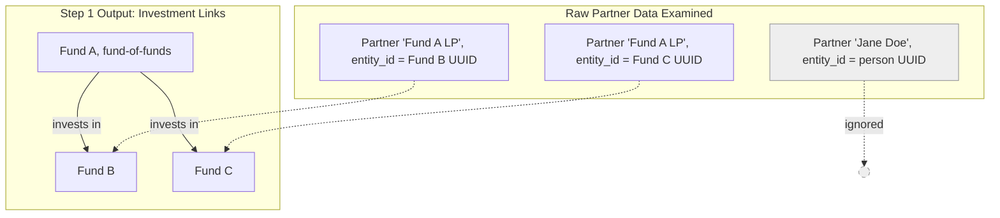
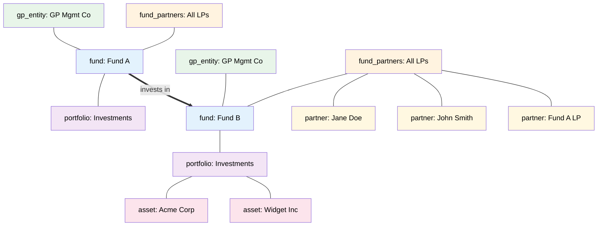
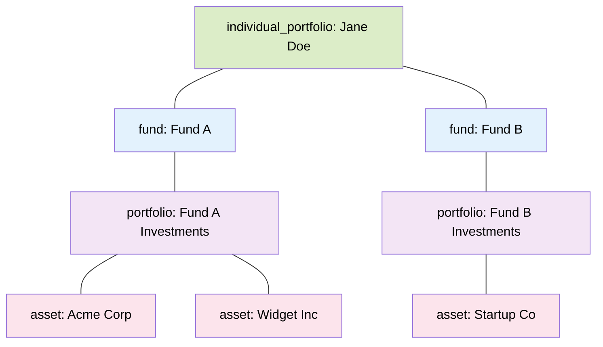
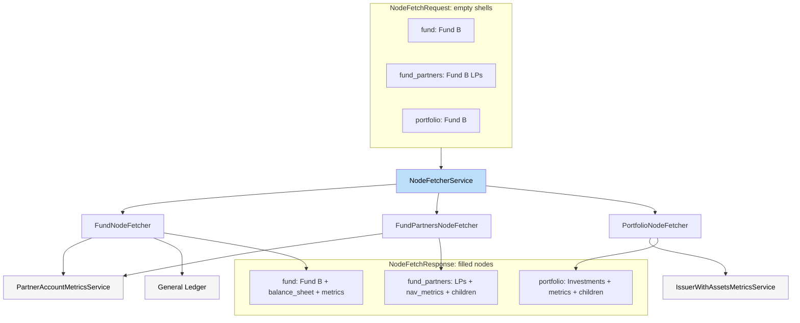
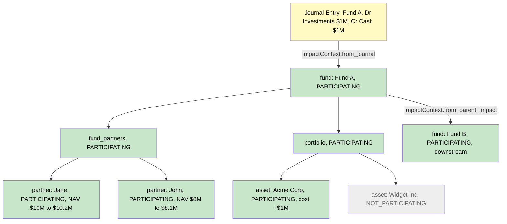
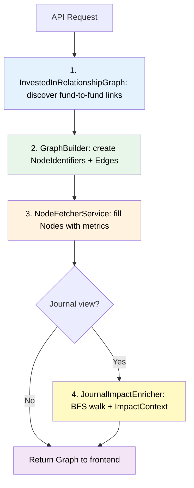

# Entity Map — How It All Works (Simply)

## The Big Picture

The entity map is a **picture of who owns what** in a fund administration firm. It draws a tree/graph showing funds, investors, assets, and how money flows between them.

---

## Data Models Quick Reference

Before diving in, here are the main data structures you'll see throughout. All live in `entity_map/domain.py` unless noted.

### The Graph Itself

| Model | What it is | Key fields |
|-------|-----------|------------|
| **`Graph`** | The final output — a bag of nodes and edges | `nodes: list[Node]`, `edges: list[Edge]` |
| **`GraphOverTime`** | Same but for journal impact (has before/after) | `nodes: list[NodeOverTime]`, `edges: list[Edge]` |
| **`Edge`** | A line connecting two nodes | `from_node_id`, `to_node_id`, `weight` |

### Nodes

| Model | What it is | Key fields |
|-------|-----------|------------|
| **`Node`** | One box on the map (a fund, a partner, an asset, etc.) | `id`, `type: NodeType`, `name`, `metadata: dict`, `metrics`, `nav_metrics`, `balance_sheet`, `children: list[Node]` |
| **`NodeOverTime`** | Same but with before/after/change and a participation state | adds `state: NodeState`, swaps to `NAVMetricsOverTime`, `BalanceSheetOverTime` |
| **`NodeIdentifier`** | A lightweight "we need this node" placeholder (type + id) | `node_type: NodeType`, `node_id: str` |
| **`NodeType`** | The 7 kinds of node | `"fund"`, `"portfolio"`, `"asset"`, `"partner"`, `"gp_entity"`, `"fund_partners"`, `"individual_portfolio"` |
| **`NodeState`** | Journal impact participation | `PARTICIPATING`, `NOT_PARTICIPATING`, `INCALCULABLE` |

### Financial Metrics

| Model | What it is | Key fields |
|-------|-----------|------------|
| **`MetricsOverTime`** | Generic start/end/change number bag | `start_metrics: dict`, `end_metrics: dict`, `change_metrics: dict` — keys are metric names like `commitment`, `called_capital`, `distribution`, `dpi`, `tvpi`, `rvpi`, `unrealized_gain_loss` |
| **`NAVMetrics`** | Net Asset Value + waterfall breakdown | `ending_nav: Decimal`, `nav_components: dict[str, Decimal]` |
| **`NAVMetricsOverTime`** | NAV with before/after | `start: NAVMetrics`, `change: NAVMetrics`, `end: NAVMetrics` |
| **`SummarizedBalanceSheet`** | Fund-level balance sheet | `assets: BalanceSheetSection`, `liabilities: BalanceSheetSection`, `investors_capital: BalanceSheetSection` |
| **`BalanceSheetOverTime`** | Balance sheet with before/after | `start`, `change`, `end` (each a `SummarizedBalanceSheet`) |

### Entity-Specific Models

| Model | What it is | Key fields |
|-------|-----------|------------|
| **`PartnerMetadata`** | One investor's identity + numbers | `name`, `uuid`, `id`, `metrics: MetricsOverTime`, `nav_metrics: NAVMetrics`, `entity_id` (points to another fund if fund-of-funds) |
| **`IssuerMetadata`** | One portfolio company/asset | `id`, `name`, `latest_valuation_date`, `metrics: MetricsOverTime` |

### Fetcher Models (in `services/domain.py`)

| Model | What it is | Key fields |
|-------|-----------|------------|
| **`NodeFetchRequest`** | "Here are the empty shells, go fill them" | `firm_uuid`, `node_identifiers: list[NodeIdentifier]`, `end_date`, `invested_in_relationship_graph` |
| **`NodeFetchResponse`** | "Here are the filled nodes back" | `nodes_by_id: dict[str, Node]`, `edges: list[Edge]` |

### Journal Impact Models

| Model | Where | What it is |
|-------|-------|-----------|
| **`ImpactContext`** | `journal_impact/impact_context.py` | The big context object passed through BFS — carries `fund_id`, `target_journals`, `carry_impact`, `partner_metrics_impact_result`, `issuer_impact_by_issuer_id`, `partners`, and more. Factory methods: `from_journal()` (root), `from_parent_impact()` (downstream), `with_zero_impact()` (passthrough) |
| **`IssuerMetricsImpact`** | `journal_impact/issuer/domain.py` | Per-asset change: `cost_basis`, `unrealized_gain_loss`, `total_value` |
| **`CarryImpactResult`** | `journal_impact/carry/domain.py` | Carry (promote) deltas per partner: `partner_impacts: list[PartnerCarryImpact]`, `total_carry_impact` |

---

## Step 1: Figure Out Who's Connected to Who

Before drawing anything, the system asks: **"which funds invest in other funds?"**

Some funds are "fund-of-funds" — they invest in other funds instead of (or in addition to) stocks and companies. The `InvestedInRelationshipGraph` figures this out by looking at partners whose `entity_id` points to another fund. That's the signal: "this partner isn't a person, it's another fund."

> **Model in play**: `PartnerMetadata.entity_id` — if this UUID matches another fund, that's a fund-of-funds link. The `InvestedInRelationshipGraph` stores these as `investing_fund_id → [invested_fund_ids]` maps.

---

## Step 2: Build the Shape (Nodes + Edges)

The `GraphBuilder` decides **what boxes go on the screen** and **what lines connect them**. At this stage, nodes are just `NodeIdentifier` shells — a type + an ID, no data yet.

The 7 node types:

| NodeType | What it represents |
|----------|-------------------|
| `fund` | A fund |
| `gp_entity` | The GP / management company |
| `fund_partners` | Bucket holding all LPs in a fund |
| `partner` | One individual investor |
| `portfolio` | Bucket holding a fund's investments |
| `asset` | One company/issuer invested in |
| `individual_portfolio` | Root node for CRM entity (investor) view |

### Firm View Shape

### CRM Entity View Shape (One Investor)

No `fund_partners` bucket — the investor **is** the root.

> **Models in play**: `GraphBuilder` produces `NodeIdentifier` objects (`node_type` + `node_id`) and `Edge` objects (`from_node_id`, `to_node_id`). These get bundled into a `NodeFetchRequest` and sent to the fetcher service.

---

## Step 3: Fill in the Numbers (Fetchers)

`NodeFetcherService` takes the `NodeFetchRequest` (list of empty `NodeIdentifier`s) and returns a `NodeFetchResponse` (filled `Node` objects with metrics). It uses a **registry** — each `NodeType` maps to a specialized fetcher that runs in parallel.

What each fetcher puts on the node:

| Fetcher | Fills in | Data source |
|---------|---------|-------------|
| **FundNodeFetcher** | `balance_sheet` (SummarizedBalanceSheet), `metrics` (MetricsOverTime) | GL balance sheets, partner metrics aggregated |
| **FundPartnersNodeFetcher** | `nav_metrics` (NAVMetrics), `children` (partner nodes) | PartnerAccountMetricsService |
| **PartnerNodeFetcher** | `metrics` (MetricsOverTime), `nav_metrics` (NAVMetrics) | PartnerAccountMetricsService rollforward |
| **PortfolioNodeFetcher** | `metrics` (MetricsOverTime), `children` (asset nodes) | IssuerWithAssetsMetricsService |
| **GPEntityNodeFetcher** | `balance_sheet`, `children` (GP partner nodes) | GL, ManagingEntityLinksService |
| **IndividualPortfolioNodeFetcher** | `metrics` aggregated across all funds, `nav_metrics` | Sums partner metrics from all fund memberships (includes GP entity funds not in the relationship graph) |

> **Key metric names** in `MetricsOverTime.end_metrics`: `commitment`, `called_capital`, `distribution`, `dpi`, `tvpi`, `rvpi`, `unrealized_gain_loss`. The `NAVMetrics.nav_components` dict breaks NAV into waterfall buckets (return of capital, preferred return, catch-up, carried interest, etc.).

---

## Step 4 (Optional): Journal Impact

The "time travel" feature. When a journal entry is posted, the system shows **what changed** across the entire graph.

1. Build the graph as of the journal date (Steps 1-3)
2. `JournalImpactEnricher` creates an `ImpactContext` from the journal
3. **BFS walk** from the journal's fund outward — at each node, calculate before/after/change
4. For fund-of-funds, create a child `ImpactContext` via `from_parent_impact()` and keep walking

> **Models in play**: The graph converts from `Graph` to `GraphOverTime`, nodes from `Node` to `NodeOverTime`. Each `NodeOverTime` gets a `state` (PARTICIPATING / NOT_PARTICIPATING / INCALCULABLE) and its metrics become the "over time" variants: `MetricsOverTime` (already has start/end/change), `NAVMetricsOverTime`, `BalanceSheetOverTime`.
>
> The `ImpactContext` is the big carrier object — it holds the journal lines, carry deltas (`CarryImpactResult`), partner allocation impacts (`PartnerMetricImpactResult`), issuer impacts (`IssuerMetricsImpact`), and sync configs. Factory methods control how it propagates: `from_journal()` at the root, `from_parent_impact()` for downstream funds, `with_zero_impact()` for pass-through.

---

## Step 5: Access Control (CRM Entity View)

The CRM entity view applies two layers of filtering:

### Fund-Level Permissions

The view requires `view_investments` and `view_fund_performance` on a fund for it to appear. This is a two-way intersection — missing either permission on a fund removes that fund from the graph entirely.

- Staff users bypass this (`permitted_fund_uuids=None` → no filtering)
- Firm members without any fund permissions get an empty graph (200, not 403)
- Filtering happens via `InvestedInRelationshipGraph.filtered_to_permitted_funds()`, which prunes `fund_ids_to_fund` and edges before the graph is built
- For the CRM entity view, GP entity funds are included in the relationship graph so they participate in permission filtering alongside LP funds

> **Code**: `entity_map/views/entity_map_crm_entity_view.py` — `_get_permitted_fund_uuids()`

### LP Sharing Date Cutoff

Each fund can have an `lp_sharing_to_date` (from CorporationService/gRPC). The entity map takes the **earliest** sharing date across all visible funds and uses it as `end_date` for all metrics. The most conservative cutoff wins — no fund shows data beyond what the most restricted fund allows.

- If no fund has a sharing date, `end_date` passes through as-is (defaults to today-like behavior)
- If a caller passes an `end_date` already earlier than the sharing date, the caller's date is kept

> **Code**: `entity_map/entity_map_service.py` — `get_crm_entity_tree()` resolves sharing dates before calling `build_graph()`

---

## The Views

| View | Entry point | What it shows |
|------|------------|--------------|
| **Firm** | `EntityMapService.get_firm_tree()` | Every fund in the firm, all connected |
| **Fund** | `EntityMapService.get_fund_and_related_funds_tree()` | One fund + related funds |
| **CRM Entity** | `EntityMapService.get_crm_entity_tree()` | One investor across all their funds |
| **Journal** | `EntityMapService.get_journal_impact()` | Fund view + before/after/change from a journal |

---

## TL;DR Pipeline

---

## Key Files

| File | Role |
|------|------|
| `entity_map/entity_map_service.py` | Front door — factory methods for each view |
| `entity_map/invested_in_relationship_graph.py` | Pre-computes fund-to-fund investment links |
| `entity_map/graph_builder.py` | Decides the shape (nodes + edges) |
| `entity_map/services/node_fetcher_service.py` | Fills nodes via registry of fetchers |
| `entity_map/journal_impact/journal_impact_enricher.py` | BFS walk for journal before/after |
| `entity_map/journal_impact/impact_context.py` | Carrier object for journal impact state |
| `entity_map/domain.py` | All data structures (Graph, Node, Edge, metrics) |
| `entity_map/services/domain.py` | NodeFetchRequest / NodeFetchResponse |
| `entity_map/constants.py` | Metric name constants |
| `entity_map/views/entity_map_crm_entity_view.py` | DRF view — permission filtering + sharing date resolution |
| `entity_map/node_builders/individual_portfolio_node_builder.py` | Builds the `individual_portfolio` root node |
